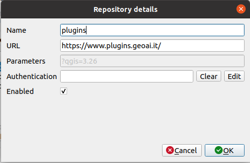

# Panaro-tool

#### Download and install

It can be installed on QGIS3.x adding the Plugin Repository to QGIS ```manage and install plugins```:
- flag ```show also experimental plugins```


- add plugin repository


- edit repository and add [https://www.plugins.geoai.it/panaro-plugin/tools.xml](https://www.plugins.geoai.it/panaro-plugin/tools.xml)


<p>

or

cloning the [GitHub repository](https://github.com/giactitti/Panaro-tools) or downloading it as zip file (and than unzipping it) and copying the ```sz_module``` folder in your local ```python/plugin``` folder (read [here](https://docs.qgis.org/3.10/en/docs/user_manual/plugins/plugins.html#core-and-external-plugins) for more information).

Lunch QGIS 3.x, and abilitate the plugin from ```manage and install plugin/installed/panaro-plugin```


<p>
  
At the end you should have the Panaro plugin in your processing toolbox


<p>
    
## Contacts
If you have any problem, please pull request or write to giacomotitti@gmail.com
